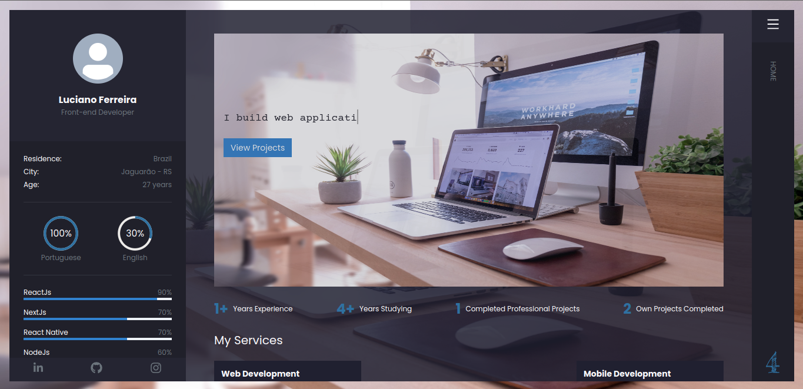
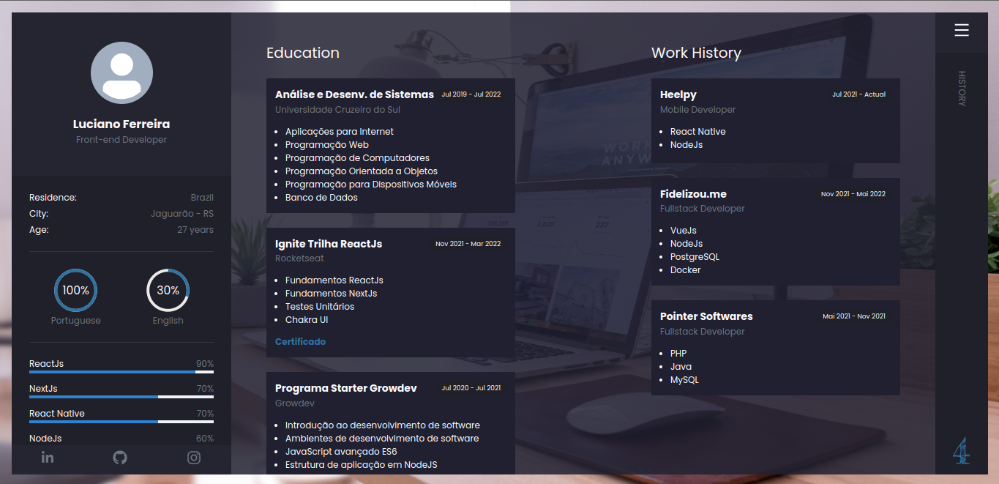

<p align="center">
   
</p>

<p align="center">
   <a href="https://www.linkedin.com/in/luciano-ferreira-b302b61a7/">
      
   </a>

  
</p>

> O projeto consiste em um protótipo de portfólio.

## Fotos

<div>
   
   
</div>

## 💻 Tecnologias

Este projeto foi feito utilizando as seguintes tecnologias:

- [React](https://reactjs.org)
- [TypeScript](https://www.typescriptlang.org/)
- [Chakra](https://chakra-ui.com/)

## 🛠️ Executando

```bash
# Clone o Repositório
$ git clone https://github.com/Ferreira94/old-portfolio.git
```

```bash
# Baixe as dependendências
$ yarn install
```

```bash
# Execute
$ yarn dev
```

Acesse <http://localhost:3000> para ver o resultado.

## 🖊️ Autores

<table>
  <tr>
    <td align="center">
      <a href="https://github.com/Ferreira94">
        
        <br />
        <sub>
          <b>Luciano Ferreira</b>
        </sub>
       </a>
       <br />
       <a href="https://www.linkedin.com/in/luciano-ferreira-b302b61a7/" title="Linkedin">@ferreira94</a>
       <br />
       <a href="https://github.com/Ferreira94?tab=repositories" title="Code">💻</a>
    </td>
  </tr>
</table>

## 📃 Licença

Este projeto está sob a licença [MIT](./LICENSE).
